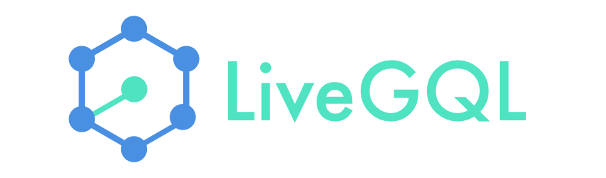

[](http://www.java.com/en/)
[](http://graphql.org/)
[](http://blog.yjl.im/2014/06/beer-ware-license-revision-42.html)


This a simple java library in order to use GraphQL Subscription on WebSocket based on Apollo Protocol.

## Features ##
  - [x] connect to a GraphQL server
  - [ ] Handle init payload
  - [x] Subscribe/Unsubscribe
  - [x] Close connection
  - [x] Error handling
  - [ ] Json handling
  - [ ] Manage generic types

## Requirements ##

java version >= 1.7

## iOS ##

You'll find the iOS version for this library here: [iOS liveGQL](https://github.com/florianmari/LiveGQL)

## How to install ##

### Gradle ###

```gradle

// project gradle
repositories {
  maven {
    url "https://dl.bintray.com/billy-bichon/Maven/"
  }
}

// module gradle
dependency {
  compile 'com.github.billy-bichon:livegql:1.0'
}
```

### maven ###

```maven
<repository>
  <id>LiveGQL</id>
  <name>LiveGQL Repository</name>
  <url>https://dl.bintray.com/billy-bichon/Maven/</url>
</repository>

<dependency>
  <groupId>com.github.billy-bichon</groupId>
  <artifactId>livegql</artifactId>
  <version>1.0</version>
</dependency>
```

### manually ###

Just copy the `livegql-1.0.jar` inside your libs folder and be sure to use:
```gradle
dependency {
  compile fileTree(dir: 'libs', include: ['*.jar'])
}
```

## How to use ##

##### Initialize #####
```java
LiveGQL liveGQL = new LiveGQL("ws://your.url", new LiveGQLListener() {
    // overide methods
  }
);
```

##### subscription #####
```java
// subscribe
Subscription subscription = liveGQL.subscribe("query to subscribe", "tag");

// Unsubscribe
liveGQL.unsubscribe(subscription);
```

##### close connection #####
```java
liveGQL.closeConnection();
```

## Dependency ##

Libraries on which liveGQL depends:
  - [Tyrus](https://github.com/tyrus-project/tyrus) for managing websocket
  - [Gson](https://github.com/google/gson) for handling json object

## Bugs ##
  - Error are not handled but your app won't crash (because it's on the stream ;))
